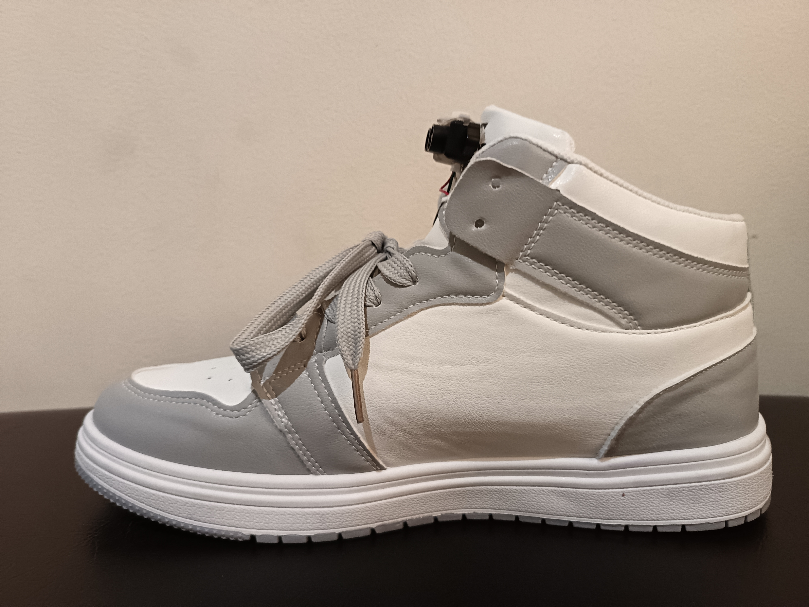

<h1 style="text-align: center; color: #2d89ef; font-family: 'Arial', sans-serif;">SmartStep: Walk Your Way to Independence</h1>

<h3 style="font-family: 'Georgia', serif; line-height: 1.6; text-align: justify;">
Introducing <strong>SmartStep</strong>, a groundbreaking innovation designed to transform the lives of visually impaired individuals. This cutting-edge smart shoe, powered by the mighty ESP32 microcontroller and a high-precision LiDAR sensor, acts as a guardian for safe navigation. By detecting obstacles in real time and providing seamless auditory feedback via a web server, <strong>SmartStep</strong> ensures that every step is confident and secure. 
  
With its compact design and intuitive functionality, SmartStep empowers users with enhanced spatial awareness, granting independence like never before.
</h3>

<h2 style="color: #4CAF50;">✨ Features That Make Every Step Smarter</h2>
<ul style="font-size: 1.2em; line-height: 1.8;">
  <li><strong>Real-Time Obstacle Detection:</strong> Accurately identifies objects within a range of 10 to 250 cm.</li>
  <li><strong>Auditory Feedback:</strong> Intelligently sends commands (<code>PLAY_SOUND</code>, <code>BLOCKED</code>, <code>STOP_SOUND</code>) to a web server, delivering precise audio cues to the user.</li>
  <li><strong>Compact and Efficient Design:</strong> Effortlessly integrates into footwear for a discreet, wearable solution.</li>
</ul>

<h2 style="color: #FF5722;">🔧 System Overview</h2>
<table style="width: 100%; border-collapse: collapse; text-align: left; font-size: 1em;">
  <tr style="background-color: #f9f9f9;">
    <th style="padding: 10px; border: 1px solid #ddd;">Component</th>
    <th style="padding: 10px; border: 1px solid #ddd;">Function</th>
  </tr>
  <tr>
    <td style="padding: 10px; border: 1px solid #ddd;">ESP32 Microcontroller</td>
    <td style="padding: 10px; border: 1px solid #ddd;">Processes LiDAR data and sends commands to the web server.</td>
  </tr>
  <tr>
    <td style="padding: 10px; border: 1px solid #ddd;">LiDAR Sensor</td>
    <td style="padding: 10px; border: 1px solid #ddd;">Measures distances with high accuracy to detect obstacles.</td>
  </tr>
  <tr style="background-color: #f9f9f9;">
    <td style="padding: 10px; border: 1px solid #ddd;">Web Server</td>
    <td style="padding: 10px; border: 1px solid #ddd;">Delivers audio cues like <code>PLAY_SOUND</code>, <code>BLOCKED</code>, and <code>STOP_SOUND</code>.</td>
  </tr>
</table>

<h2 style="color: #9C27B0;">🚀 How It Works</h2>
<ol style="font-size: 1.1em; line-height: 1.8;">
  <li><strong>Connect:</strong> The ESP32 establishes a Wi-Fi connection and launches its web server.</li>
  <li><strong>Scan:</strong> The LiDAR sensor scans the environment for objects, feeding data to the ESP32.</li>
  <li><strong>Command:</strong> Based on object proximity, commands (<code>PLAY_SOUND</code>, <code>BLOCKED</code>, <code>STOP_SOUND</code>) are sent to the web server.</li>
  <li><strong>Feedback:</strong> The server plays appropriate auditory cues to guide the user safely.</li>
</ol>

<h2 style="color: #2196F3;">🛠️ Installation Made Simple</h2>
<ol style="font-size: 1.1em; line-height: 1.8;">
  <li>Upload the provided code to your ESP32 microcontroller and set the baud rate to <code>115200</code>.</li>
  <li>Replace the Wi-Fi credentials in the code with your hotspot's <code>SSID</code> and <code>Password</code>.</li>
  <li>Power up the ESP32, place it in the shoe, and you're all set!</li>
</ol>

<h3 style="text-align: center; font-style: italic; color: #555;">“Step boldly into the future with SmartStep, where every stride is smart, safe, and empowering.”</h3>

